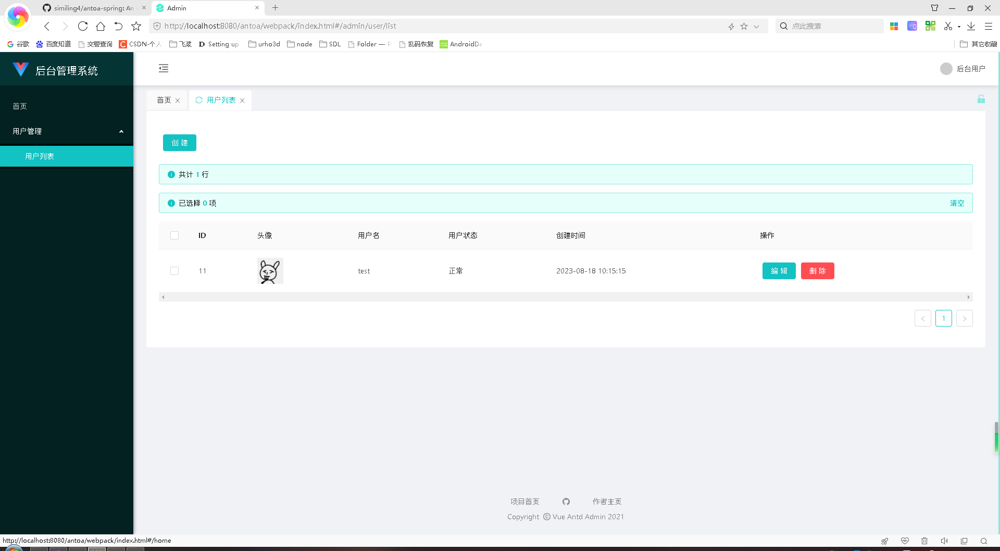
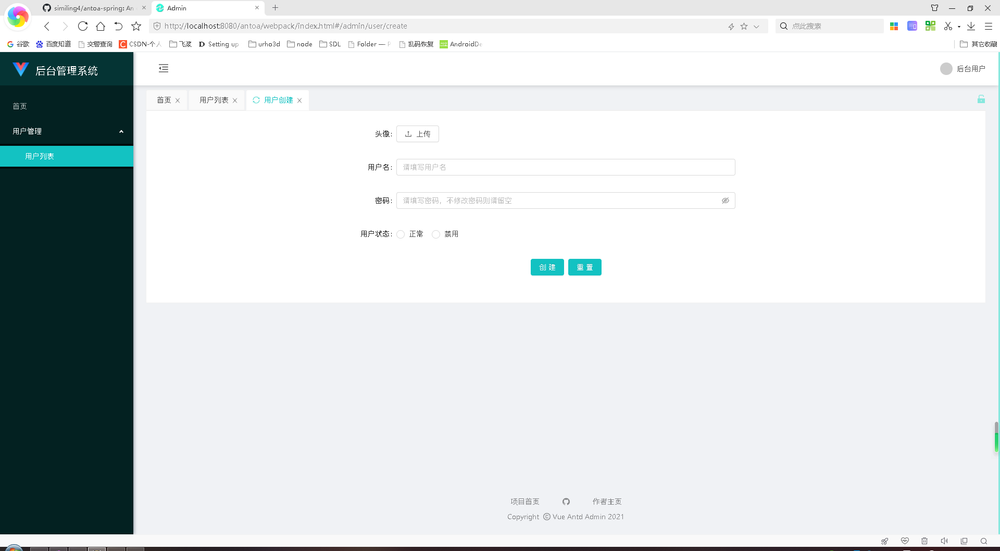
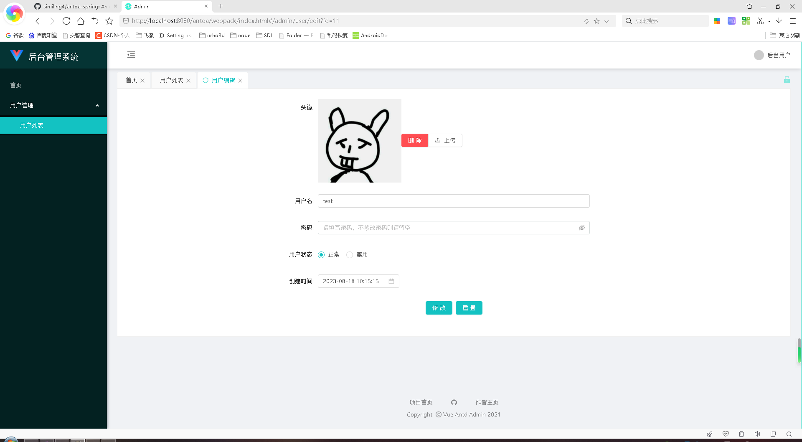

# AntOA Spring

本项目是AntOA项目的Spring移植项目。

本项目为后台开发者的后台管理系统框架，开发者可以通过简单的配置轻松实现各种后台简单或稍显复杂的交互

[](https://github.com/similing4/antoa-spring/blob/master/LICENSE)
[](https://github.com/similing4/antoa-spring/releases/latest)

## 文档
[Github](https://similing4.github.io/antoa-spring)
[Gitee](https://similing.gitee.io/antoa-spring)

## 安装

克隆本项目，使用eclipse导入本项目并修改application.yml，运行com.whuying.MainApplication类。

## 功能展示
```java
@RestController
@RequestMapping("/api/admin/user")
public class UserAntOAController extends AntOAController {

    @Override
    public void grid(Grid grid) {
        grid.list(new DBListOperator(DB.table("user")) {})
            .columnText("id", "ID")
            .columnPicture("user_icon", "头像", "50", "50")
            .columnText("username", "用户名")
            .columnEnum("status", "用户状态", Arrays.asList(
                new EnumOption("0", "正常"),
                new EnumOption("1", "禁用")
            ))
            .columnText("create_time", "创建时间");
        grid.createForm(new DBCreateOperator(DB.table("user")) {
        })
            .columnPictureLocal("user_icon", "头像")
            .columnText("username", "用户名")
            .columnPassword("password", "密码")
            .columnRadio("status", "用户状态", Arrays.asList(
                new EnumOption("0", "正常"),
                new EnumOption("1", "禁用")
            ));
        grid.editForm(new DBEditOperator(DB.table("user")) {
        })
            .columnHidden("id")
            .columnPictureLocal("user_icon", "头像")
            .columnText("username", "用户名")
            .columnPassword("password", "密码")
            .columnRadio("status", "用户状态", Arrays.asList(
                new EnumOption("0", "正常"),
                new EnumOption("1", "禁用")
            ))
            .columnTimestamp("create_time", "创建时间");
    }

    @Override
    public String statistic() {
        return "";
    }

    @Override
    protected boolean checkPower(String uid) {
        return true;
    }
}

```



