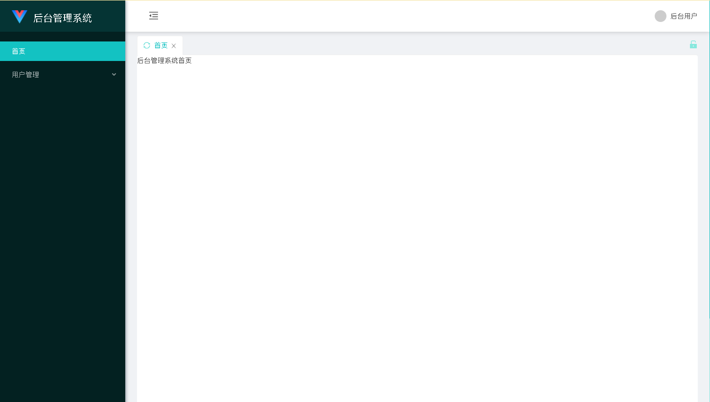
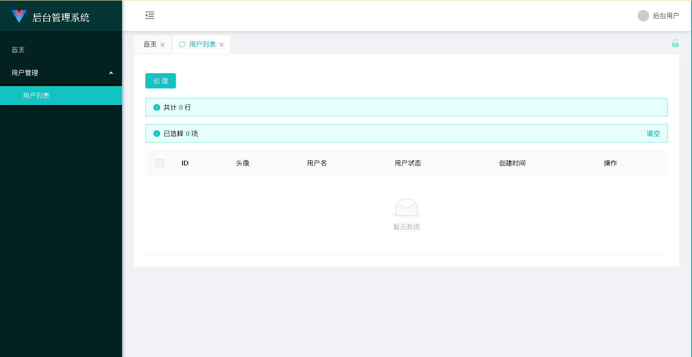
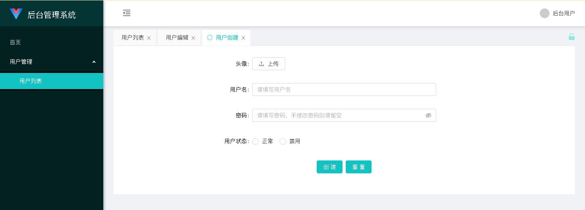
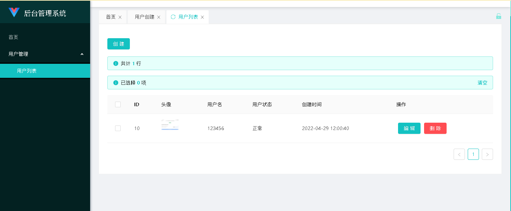
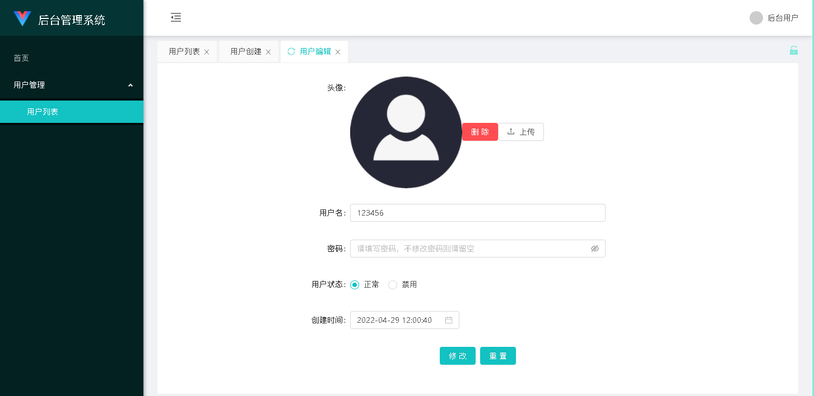

初始安装部分详见 一、指南->安装与初始化配置

如果想开发一个对应实体（比如用户）的管理功能，你需要在包com.whuying.web下的任意子包下创建一个控制器继承com.whuying.antoa.controller.AntOAController，以UserController为例：

```java
import org.springframework.web.bind.annotation.RequestMapping;
import org.springframework.web.bind.annotation.RestController;
import com.whuying.antoa.controller.AntOAController;
import com.whuying.antoa.db.DB;
import com.whuying.antoa.utils.DBCreateOperator;
import com.whuying.antoa.utils.DBEditOperator;
import com.whuying.antoa.utils.DBListOperator;
import com.whuying.antoa.utils.Grid;
import com.whuying.antoa.utils.GridCreateForm;
import com.whuying.antoa.utils.GridEditForm;
import com.whuying.antoa.utils.GridList;

@RestController
public class UserController extends AntOAController {

    @Override
    public void grid(Grid grid) {
        ;
    }

    @Override
    public String statistic() {
        return "";
    }

    @Override
    protected boolean checkPower(String uid) {
        return true;
    }
}

```

假设我们都用户表是user，用户表包含字段如下：

```sql
CREATE TABLE `user` (
 `id` int(10) unsigned NOT NULL AUTO_INCREMENT COMMENT 'ID',
 `user_icon` varchar(100) COLLATE utf8mb4_unicode_ci NOT NULL COMMENT '用户头像地址',
 `username` varchar(100) COLLATE utf8mb4_unicode_ci NOT NULL COMMENT '用户名',
 `password` varchar(32) COLLATE utf8mb4_unicode_ci NOT NULL COMMENT '密码',
 `status` tinyint(1) NOT NULL DEFAULT '1' COMMENT '状态（0正常1禁用）',
 `create_time` timestamp NOT NULL DEFAULT CURRENT_TIMESTAMP COMMENT '创建时间',
 PRIMARY KEY (`id`) USING BTREE
) ENGINE=MyISAM AUTO_INCREMENT=10 DEFAULT CHARSET=utf8mb4 COLLATE=utf8mb4_unicode_ci ROW_FORMAT=DYNAMIC
```

那么我们就可以像这样编写grid方法：

```java
import org.springframework.web.bind.annotation.RequestMapping;
import org.springframework.web.bind.annotation.RestController;
import com.whuying.antoa.controller.AntOAController;
import com.whuying.antoa.db.DB;
import com.whuying.antoa.utils.DBCreateOperator;
import com.whuying.antoa.utils.DBEditOperator;
import com.whuying.antoa.utils.DBListOperator;
import com.whuying.antoa.utils.Grid;
import com.whuying.antoa.utils.GridCreateForm;
import com.whuying.antoa.utils.GridEditForm;
import com.whuying.antoa.utils.GridList;

@RestController
public class UserController extends AntOAController {

    @Override
    public void grid(Grid grid) { //这里编写grid相关操作
        grid.list(new DBListOperator(DB.table("user")) {})
            .columnText("id", "ID")
            .columnPicture("user_icon", "头像", "50", "50")
            .columnText("username", "用户名")
            .columnEnum("status", "用户状态", Arrays.asList(
                new EnumOption("0", "正常"),
                new EnumOption("1", "禁用")
            ))
            .columnText("create_time", "创建时间");
        grid.createForm(new DBCreateOperator(DB.table("user")) {
        })
            .columnPictureLocal("user_icon", "头像")
            .columnText("username", "用户名")
            .columnRadio("status", "用户状态", Arrays.asList(
                new EnumOption("0", "正常"),
                new EnumOption("1", "禁用")
            ));
        grid.editForm(new DBEditOperator(DB.table("user")) {
        })
            .columnHidden("id")
            .columnPictureLocal("user_icon", "头像")
            .columnText("username", "用户名")
            .columnRadio("status", "用户状态", Arrays.asList(
                new EnumOption("0", "正常"),
                new EnumOption("1", "禁用")
            ))
            .columnTimestamp("create_time", "创建时间");
    }

    @Override
    public String statistic() {
        return "";
    }

    @Override
    protected boolean checkPower(String uid) {
        return true;
    }
}
```

定义结束后我们需要为这个管理功能添加对应的页面路由配置，即集成到后台侧边栏中，因此我们需要指定这个Controller的路径并配置到application.yml中。假设我们需要用户管理路径为/admin/user，那么用户管理列表页路径就是/admin/user/list，创建页路径就是/admin/user/create，编辑页路径就是/admin/user/edit，@RequestMapping参数就应该为/api/admin/user：
```java

import java.util.Arrays;
import org.springframework.web.bind.annotation.RequestMapping;
import org.springframework.web.bind.annotation.RestController;
import com.whuying.antoa.controller.AntOAController;
import com.whuying.antoa.db.DB;
import com.whuying.antoa.utils.DBCreateOperator;
import com.whuying.antoa.utils.DBEditOperator;
import com.whuying.antoa.utils.DBListOperator;
import com.whuying.antoa.utils.Grid;
import com.whuying.antoa.utils.model.EnumOption;

@RestController
@RequestMapping("/api/admin/user")
public class UserAntOAController extends AntOAController {

    @Override
    public void grid(Grid grid) {
        grid.list(new DBListOperator(DB.table("user")) {})
            .columnText("id", "ID")
            .columnPicture("user_icon", "头像", "50", "50")
            .columnText("username", "用户名")
            .columnEnum("status", "用户状态", Arrays.asList(
                new EnumOption("0", "正常"),
                new EnumOption("1", "禁用")
            ))
            .columnText("create_time", "创建时间");
        grid.createForm(new DBCreateOperator(DB.table("user")) {
        })
            .columnPictureLocal("user_icon", "头像")
            .columnText("username", "用户名")
            .columnRadio("status", "用户状态", Arrays.asList(
                new EnumOption("0", "正常"),
                new EnumOption("1", "禁用")
            ));
        grid.editForm(new DBEditOperator(DB.table("user")) {
        })
            .columnHidden("id")
            .columnPictureLocal("user_icon", "头像")
            .columnText("username", "用户名")
            .columnRadio("status", "用户状态", Arrays.asList(
                new EnumOption("0", "正常"),
                new EnumOption("1", "禁用")
            ))
            .columnTimestamp("create_time", "创建时间");
    }

    @Override
    public String statistic() {
        return "";
    }

    @Override
    protected boolean checkPower(String uid) {
        return true;
    }
}

```

然后我们需要把需要的页面加入到application.yml配置文件中的antoa.config.menu_routes字段里：
```yml
server:
  port: 8080
spring:
  application:
    name: maven-springboot
  datasource:
    url: jdbc:mysql://127.0.0.1/test?useUnicode=true&characterEncoding=utf-8&useSSL=false&serverTimezone=Asia/Shanghai
    username: test
    password: test
    driver-class-name: com.mysql.cj.jdbc.Driver
antoa:
  config:
    home_page: 
    login_diy: false
    menu_routes:
       - name: 首页
         home: true
       - name: 用户管理
         role_limit_id: 1
         children: 
             - path: /admin/user/list
               name: 用户列表
               role_limit_id: 1
             - visible: false
               path: /admin/user/create
               name: 用户创建
               role_limit_id: 1
             - visible: false
               path: /admin/user/edit
               name: 用户编辑
               role_limit_id: 1
    qiniu:
      access_key: QiniuAccessKey
      secret_key: QiniuSecretKey
      bucket: Bucket
      url: http://xxx.xxx.com/
    template_file_path: template
```

运行后访问 http://你的域名/antoa/webpack/index.html 使用数据库表antoa_user表中的用户登录即可。默认帐户密码均为admin。

登录后如图所示：


选择左侧的用户列表后如图所示，这个页面就是我们配置好的页面啦：



