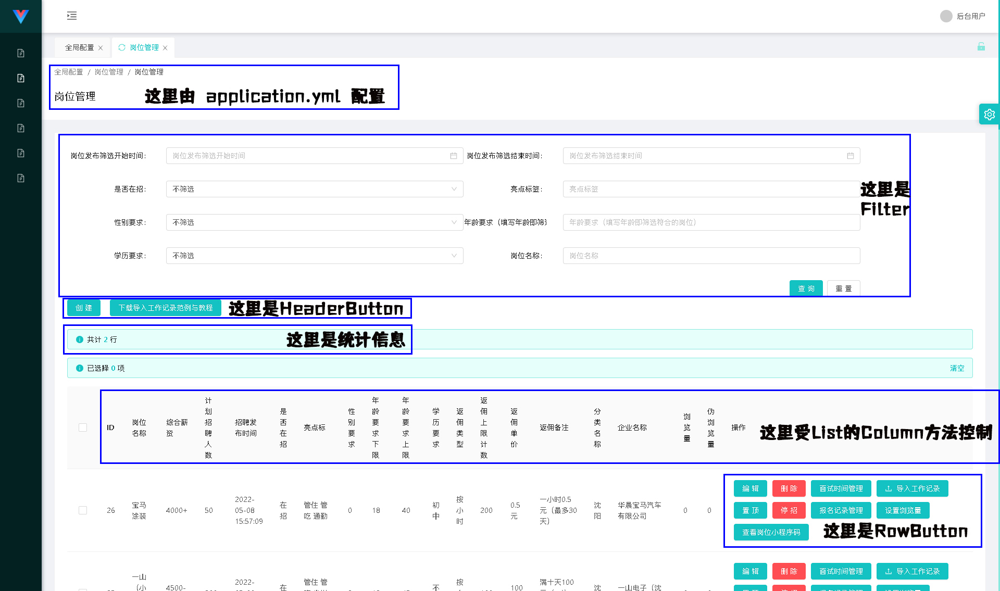

## GridList对象用法
首先我们看列表页的分块：

这里除了统计部分由控制器的statistic方法配置、面包屑部分由application.yml配置外，其余部分均由GridList配置。

GridList配置需要在AntOAController的子类中的grid方法中配置。依然以UserAntOAController举例：
```
@RestController
@RequestMapping("/api/admin/user")
public class UserAntOAController extends AntOAController {
    @Override
    public void grid(Grid grid) {
        ;
    }

    @Override
    public String statistic() {
        return "";
    }

    @Override
    protected boolean checkPower(String uid) {
        return true;
    }
}
```

## GridList对象的实例化
GridList对象需要由AntOAController的grid方法的grid参数的list方法创建。该参数接收一个DBListOperator对象。你需要按照你的需求自行构造DBListOperator对象。例：
```
    @Override
    public void grid(Grid grid) {
    	grid.list(new DBListOperator(DB.table("user")) {}); //这里参数是一个继承自DBListOperator的匿名对象，返回值是GridList对象。
    }
```
其中DBListOperator类属于com.whuying.antoa.db.DB的扩展类，com.whuying.antoa.db.DB类基于JOOQ（生成SQL）与JdbcTemplate（执行SQL）实现。DBListOperator的定义如下：
```
public abstract class DBListOperator implements Cloneable {
    /**
     * Builder
     */
    public DB builder; //DB类产生的对象，于构造方法中传入

    public DBListOperator(DB builder) {
        this.builder = builder;
    }

    public DBListOperator doClone() throws CloneNotSupportedException {
        DBListOperator clone = (DBListOperator) this.clone();
        clone.builder = builder.clone();
        return clone;
    }

    //where方法，设置的对应column会作为条件传入。你可以根据column自定义设置传入条件内容
    public DBListOperator where(String key, Object value) {
        this.where(key,"=" ,value);
        return this;
    }
    
    //where方法，设置的对应column会作为条件传入。你可以根据column自定义设置传入条件内容
    public DBListOperator where(String key, String operator, Object value) {
        this.builder.where(key, operator, value);
        return this;
    }

    //whereIn方法，设置的对应column会作为条件传入。你可以根据column自定义设置传入条件内容
    public DBListOperator whereIn(String key, Object[] values) {
        this.builder.whereIn(key, values);
        return this;
    }

    //orderBy方法，你可以在这里自定义设置排序规则。
    public DBListOperator orderBy(String column, String direction) {
        this.builder.orderBy(column, direction);
        return this;
    }

    //select方法，如果你有连接查询你可以在这里将查询字段格式化为正确的字段解决冲突。
    public DBListOperator select(String... columns) {
        this.builder.setFields(columns);
        return this;
    }

    //分页方法，不建议直接重写本方法，建议直接通过hook修改结果。
    public PaginateResult paginate(int pageCount) {
        return this.builder.paginate(pageCount);
    }

    //当编辑页或创建页使用column为COLUMN_CHILDREN_CHOOSE类型时，extra需要使用本方法。
    public Map<String, Object> first() {
        return this.builder.first();
    }

    //detail判断、删除时判断
    public Map<String, Object> find(int id) {
        return this.builder.where("id", id).first();
    }

    //删除时进行的操作，除了重写这里之外，你也可以直接重写AntOAController的delete方法
    public int delete(int id) {
        return this.builder.delete();
    }
}
```
你可以在你的实体类中重写这个父类方法来实现你的各种功能。

## GridList对象的filter系列实例方法
filter系列方法用于列表页的筛选相关配置。该方法可以根据DBListOperator中查询的字段进行筛选。

**注：下列内容中提到的“数据库”均指的是DBListOperator实例指定的查询结果。**

### public GridList filter(ListFilterBase filterItem);
filter的通用方法

#### 参数：
* filterItem 任意ListFilterBase子类的实例。所有继承自该类的实例均以ListFilter开头，且均定义于包com.whuying.antoa.utils.model下。可用的实例如下：
	- ListFilterCascader 级联筛选（如用于省市区）
	- ListFilterStartTime 时间段开始时间筛选
	- ListFilterEndTime 时间段结束时间筛选
	- ListFilterEnum 下拉单选筛选（类似于html的select标签）
	- ListFilterHidden 隐式筛选（根据URL参数筛选）
	- ListFilterMultiSelect 多选筛选（使用whereIn筛选，没选择则不筛选）
	- ListFilterText 文本筛选（like %内容%）
	- ListFilterUID 根据当前登录的用户UID进行筛选


#### 返回值：
返回this供链式调用

### public GridList filterHidden(String col);
隐式筛选（根据URL参数筛选）

| 参数 | 参数类型 | 说明 |
| ------ | ----- | ------ |
| col | String | 筛选的数据库对应的字段名 |

#### 返回值：
返回this供链式调用

### public GridList filterText(String col, String colTip);
文本筛选（like %内容%）

| 参数 | 参数类型 | 说明 |
| ------ | ----- | ------ |
| col | String | 筛选的数据库对应的字段名 |
| colTip | String | 提示内容 |

#### 返回值：
返回this供链式调用

### public GridList filterStartTime(String col, String colTip);
时间段开始时间筛选

| 参数 | 参数类型 | 说明 |
| ------ | ----- | ------ |
| col | String | 筛选的数据库对应的字段名 |
| colTip | String | 提示内容 |

#### 返回值：
返回this供链式调用

### public GridList filterEndTime(String col, String colTip);
时间段结束时间筛选

| 参数 | 参数类型 | 说明 |
| ------ | ----- | ------ |
| col | String | 筛选的数据库对应的字段名 |
| colTip | String | 提示内容 |

#### 返回值：
返回this供链式调用

### public GridList filterEnum(String col, String colTip, List<EnumOption> options);
下拉单选筛选（类似于html的select标签）

| 参数 | 参数类型 | 说明 |
| ------ | ----- | ------ |
| col | String | 筛选的数据库对应的字段名 |
| colTip | String | 提示内容 |
| options | List<EnumOption> | 选项（EnumOption对象数组） |

#### 返回值：
返回this供链式调用

### public GridList filterMultiSelect(String col, String colTip, List<EnumOption> options);
多选筛选（使用whereIn筛选，没选择则不筛选）

| 参数 | 参数类型 | 说明 |
| ------ | ----- | ------ |
| col | String | 筛选的数据库对应的字段名 |
| colTip | String | 提示内容 |
| options | List<EnumOption> | 选项（EnumOption对象数组） |

#### 返回值：
返回this供链式调用

### public GridList filterCascader(String col, String colTip, List<CascaderNode> options);
级联筛选（如用于省市区）

| 参数 | 参数类型 | 说明 |
| ------ | ----- | ------ |
| col | String | 筛选的数据库对应的字段名 |
| colTip | String | 提示内容 |
| options | List<CascaderNode> | 选项（CascaderNode对象数组） |

#### 返回值：
返回this供链式调用

### public GridList filterUid(String col);
根据当前登录的用户UID进行筛选

| 参数 | 参数类型 | 说明 |
| ------ | ----- | ------ |
| col | String | 筛选的数据库对应的字段名 |

#### 返回值：
返回this供链式调用


## GridList对象的column系列实例方法
column系列方法用于列表页的表格的列的配置。该方法可以将DBListOperator中对应的查询字段通过一定的变化展示到页面上。

**注：下列内容中提到的“数据库”均指的是DBListOperator实例指定的查询结果。**

### public GridList column(ListTableColumnBase column);
column的通用方法

#### 参数：
* column 任意ListTableColumnBase子类的实例。所有继承自该类的实例均以ListTableColumn开头，且均定义于包com.whuying.antoa.utils.model下。可用的实例如下：
	- ListTableColumnDisplay 只用于展示，需要通过hook方法配置其值，默认没有值。
	- ListTableColumnDivideNumber 用于将数据库行中指定列的查询结果以数字除以固定数值展示。如将金额（单位分）100转换为1元展示。
	- ListTableColumnEnum 用于将数据库行中指定列根据提供的字典翻译为对应的展示内容。如0为禁用1为启用，查询结果为0时就展示禁用。
	- ListTableColumnHidden 用于查询数据库指定列，但不在页面上展示
	- ListTableColumnPicture 用于将数据库行中指定列作为图片地址输出为图片在表内展示。
	- ListTableColumnRichDisplay 只用于展示富文本内容，需要通过hook方法配置其值，默认没有值
	- ListTableColumnRichText 用于数据库行中指定列作为富文本内容输出。
	- ListTableColumnText 用于将数据库行中指定列作为普通文本内容输出。


#### 返回值：
返回this供链式调用

### public GridList columnText(String col, String colTip);
用于将数据库行中指定列作为普通文本内容输出。

| 参数 | 参数类型 | 说明 |
| ------ | ----- | ------ |
| col | String | 数据库对应的字段名 |
| colTip | String | 提示内容 |

#### 返回值：
返回this供链式调用

### public GridList columnDisplay(String col, String colTip);
只用于展示，需要通过hook方法配置其值，默认没有值。

| 参数 | 参数类型 | 说明 |
| ------ | ----- | ------ |
| col | String | 数据库对应的字段名 |
| colTip | String | 提示内容 |

#### 返回值：
返回this供链式调用

### public GridList columnRichDisplay(String col, String colTip);
只用于展示富文本内容，需要通过hook方法配置其值，默认没有值

| 参数 | 参数类型 | 说明 |
| ------ | ----- | ------ |
| col | String | 数据库对应的字段名 |
| colTip | String | 提示内容 |

#### 返回值：
返回this供链式调用

### public GridList columnPicture(String col, String colTip, String width, String height);
用于将数据库行中指定列作为图片地址输出为图片在表内展示。

| 参数 | 参数类型 | 说明 |
| ------ | ----- | ------ |
| col | String | 数据库对应的字段名 |
| colTip | String | 提示内容 |
| width | String | 宽度（需要带单位如35px） |
| height | String | 高度（同width） |

#### 返回值：
返回this供链式调用

### public GridList columnEnum(String col, String colTip, List<EnumOpiton> options);
用于将数据库行中指定列根据提供的字典翻译为对应的展示内容。如0为禁用1为启用，查询结果为0时就展示禁用。

| 参数 | 参数类型 | 说明 |
| ------ | ----- | ------ |
| col | String | 数据库对应的字段名 |
| colTip | String | 提示内容 |
| options | List<EnumOption> | 选项（EnumOption对象数组） |

#### 返回值：
返回this供链式调用
#### 范例：
```
gridLis.columnEnum("status","状态", Arrays.asList(new EnumOpiton[]{
	new EnumOpiton("0", "禁用"),
	new EnumOpiton("1", "启用")
}));
```

### public GridList columnRichText(String col, String colTip);
用于数据库行中指定列作为富文本内容输出。

| 参数 | 参数类型 | 说明 |
| ------ | ----- | ------ |
| col | String | 数据库对应的字段名 |
| colTip | String | 提示内容 |

#### 返回值：
返回this供链式调用

### public GridList columnHidden(String col);
用于查询数据库指定列，但不在页面上展示。

| 参数 | 参数类型 | 说明 |
| ------ | ----- | ------ |
| col | String | 数据库对应的字段名 |

#### 返回值：
返回this供链式调用

### public GridList columnDivideNumber(String col, String colTip, double divide, String unit);
用于将数据库行中指定列的查询结果以数字除以固定数值展示。如将金额（单位分）100转换为1元展示。

| 参数 | 参数类型 | 说明 |
| ------ | ----- | ------ |
| col | String | 数据库对应的字段名 |
| colTip | String | 提示内容 |
| divide | double | 被除数（如100分转为1元应传100） |
| unit | String | 单位，默认为空（如100转为1元应传入“元”） |

#### 返回值：
返回this供链式调用

## HeaderButton系列方法
列表页的按钮分为顶部按钮（HeaderButton）、每行按钮（RowButton）两种。HeaderButton系列方法用于配置顶部按钮。

默认情况下顶部按钮只有一个“创建”按钮，你可以使用useCreate(false);方法禁用创建按钮。
下面的参数类均继承自ListHeaderButtonBase类，实例化时都需要实现如下两个方法：
```
/**
 * 根据页面参数计算实际调用地址，返回值将会被用作finalUrl参数
 * @param UrlParamCalculator calculator 传入的页面参数的实例
 * @return array<UrlParamCalculatorParamItem> 并入到baseURL的URL参数
 */
abstract GridList calcButtonParam(UrlParamCalculator calculator);

/**
 * 根据页面参数计算当前按钮是否显示
 * @param UrlParamCalculator calculator 传入的页面参数的实例
 * @return bool 返回真则显示，否则不显示
 */
abstract public GridList judgeIsShow(UrlParamCalculator calculator);
```
其中calcButtonParam方法用于计算按钮跳转或调用的目标链接的携带参数，其UrlParamCalculator calculator封装了页面携带的参数信息。

其中judgeIsShow方法用于根据页面参数判断是否显示这个按钮。

### public GridList headerNavigateButton(ListHeaderButtonNavigate listHeaderButtonItem);
设置跳转到新页面的按钮

| 参数 | 参数类型 | 说明 |
| ------ | ----- | ------ |
| listHeaderButtonItem | ListHeaderButtonNavigate | ListHeaderButtonNavigate实例 |

#### 返回值：
返回this供链式调用

### public GridList headerApiButton(ListHeaderButtonApi listHeaderButtonItem);
设置调用普通API接口的顶部按钮（返回值应返回JSON，其字段成功时status为1，data为成功提示；失败时status为0，msg为失败原因）

| 参数 | 参数类型 | 说明 |
| ------ | ----- | ------ |
| listHeaderButtonItem | ListHeaderButtonApi | ListHeaderButtonApi实例 |

#### 返回值：
返回this供链式调用

### public GridList headerApiButtonWithConfirm(ListHeaderButtonApiWithConfirm listHeaderButtonItem);
设置需要确认后才能调用普通API接口的顶部按钮（返回值应返回JSON，其字段成功时status为1，data为成功提示；失败时status为0，msg为失败原因）

| 参数 | 参数类型 | 说明 |
| ------ | ----- | ------ |
| listHeaderButtonItem | ListHeaderButtonApiWithConfirm | ListHeaderButtonApiWithConfirm实例 |

#### 返回值：
返回this供链式调用

### public GridList headerBlobButton(ListHeaderButtonBlob listHeaderButtonItem);
设置调用返回文件流API接口的顶部按钮

#### 参数：
* listHeaderButtonItem ListHeaderButtonBlob实例。这个实例在实例化时需要传入至少三个参数：
	- baseUrl 调用的URL地址（不带参数）
	- buttonText 按钮文本
	- downloadFilename 下载的文件名
	- buttonType = "primary" 按钮样式


#### 返回值：
返回this供链式调用

### public GridList headerRichTextButton(ListHeaderButtonRichText listHeaderButtonItem);
设置点击后根据提供的链接调用接口后将接口返回的内容作为富文本展示的顶部按钮（返回值应返回JSON，其字段成功时status为1，data为富文本内容；失败时status为0，msg为失败原因）

| 参数 | 参数类型 | 说明 |
| ------ | ----- | ------ |
| listHeaderButtonItem | ListHeaderButtonRichText | ListHeaderButtonRichText实例 |

#### 返回值：
返回this供链式调用

## RowButton系列方法
列表页的按钮分为顶部按钮（HeaderButton）、每行按钮（RowButton）两种。RowButton系列方法用于配置每行按钮。

默认情况下每行按钮只有一个“编辑”按钮和一个“删除”按钮，你可以使用useEdit(false);方法禁用编辑按钮、useDelete(false);方法禁用删除按钮。
下面的参数类均继承自ListRowButtonBase类，实例化时都需要实现如下两个方法：
```
/**
 * 根据页面参数计算实际调用地址，返回值将会被用作finalUrl参数
 * @param UrlParamCalculator calculator 传入的页面参数的实例
 * @return array<UrlParamCalculatorParamItem> 并入到baseURL的URL参数
 */
abstract public GridList calcButtonParam(UrlParamCalculator calculator);

/**
 * 根据页面参数计算当前按钮是否显示
 * @param UrlParamCalculator calculator 传入的页面参数的实例
 * @return bool 返回真则显示，否则不显示
 */
abstract public GridList judgeIsShow(UrlParamCalculator calculator);
```
其中calcButtonParam方法用于计算按钮跳转或调用的目标链接的携带参数，其UrlParamCalculator calculator封装了页面携带的参数信息及对应行的数据信息。

其中judgeIsShow方法用于根据页面参数信息及对应行的数据信息判断是否显示这个按钮。

### public GridList rowNavigateButton(ListRowButtonNavigate listRowButtonItem);
设置跳转到新页面的按钮

| 参数 | 参数类型 | 说明 |
| ------ | ----- | ------ |
| listRowButtonItem | ListRowButtonNavigate | ListRowButtonNavigate实例 |

#### 返回值：
返回this供链式调用

### public GridList rowApiButton(ListRowButtonApi listRowButtonItem);
设置调用普通API接口的每行按钮（返回值应返回JSON，其字段成功时status为1，data为成功提示；失败时status为0，msg为失败原因）

| 参数 | 参数类型 | 说明 |
| ------ | ----- | ------ |
| listRowButtonItem | ListRowButtonApi | ListRowButtonApi实例 |

#### 返回值：
返回this供链式调用

### public GridList rowApiButtonWithConfirm(ListRowButtonApiWithConfirm listRowButtonItem);
设置需要确认后才能调用普通API接口的每行按钮（返回值应返回JSON，其字段成功时status为1，data为成功提示；失败时status为0，msg为失败原因）

| 参数 | 参数类型 | 说明 |
| ------ | ----- | ------ |
| listRowButtonItem | ListRowButtonApiWithConfirm | ListRowButtonApiWithConfirm实例 |

#### 返回值：
返回this供链式调用

### public GridList rowBlobButton(ListRowButtonBlob listRowButtonItem);
设置调用返回文件流API接口的每行按钮

#### 参数：
* listRowButtonItem ListRowButtonBlob实例。这个实例在实例化时需要传入至少三个参数：
	- baseUrl 调用的URL地址（不带参数）
	- buttonText 按钮文本
	- downloadFilename 下载的文件名
	- buttonType = "primary" 按钮样式

#### 返回值：
返回this供链式调用

### public GridList rowRichTextButton(ListRowButtonRichText listRowButtonItem);
设置点击后根据提供的链接调用接口后将接口返回的内容作为富文本展示的每行按钮（返回值应返回JSON，其字段成功时status为1，data为富文本内容；失败时status为0，msg为失败原因）

| 参数 | 参数类型 | 说明 |
| ------ | ----- | ------ |
| listRowButtonItem | ListRowButtonRichText | ListRowButtonRichText实例 |

#### 返回值：
返回this供链式调用

### public GridList rowApiButtonWithForm(ListRowButtonWithForm listRowButtonItem);
设置点击后弹出表单模态框且点击确定能够提交到指定的调用接口的每行按钮（返回值应返回JSON，其字段成功时status为1，data为富文本内容；失败时status为0，msg为失败原因）

| 参数 | 参数类型 | 说明 |
| ------ | ----- | ------ |
| listRowButtonItem | ListRowButtonWithForm | ListRowButtonWithForm实例，注，其构造方法需要传入GridCreateFormEasy实例，该实例与GridCreateForm实例大体相同 |

#### 返回值：
返回this供链式调用

## 杂项方法
### public GridList useCreate(boolean bool);
设置是否显示创建按钮及使用创建页面

| 参数 | 参数类型 | 说明 |
| ------ | ----- | ------ |
| bool | Boolean | 为真时列表页上方按钮呈现创建按钮且创建页可以访问（前提设置了GridCreateForm配置），为假时创建按钮不展示且创建页不可用 |

#### 返回值：
返回this供链式调用

### public GridList useEdit(boolean bool);
设置是否显示编辑按钮及使用编辑页面

| 参数 | 参数类型 | 说明 |
| ------ | ----- | ------ |
| bool | Boolean | 为真时每一行列表数据的操作列中呈现编辑按钮且编辑页可以访问（前提设置了GridEditForm配置），为假时编辑按钮不展示且编辑页不可用 |

#### 返回值：
返回this供链式调用

### public GridList useDelete(bool);
设置是否显示删除按钮

| 参数 | 参数类型 | 说明 |
| ------ | ----- | ------ |
| bool | Boolean | 为真时每一行列表数据的操作列中呈现删除按钮且删除接口可以访问，为假时删除按钮不展示且删除接口不可用 |

#### 返回值：
返回this供链式调用